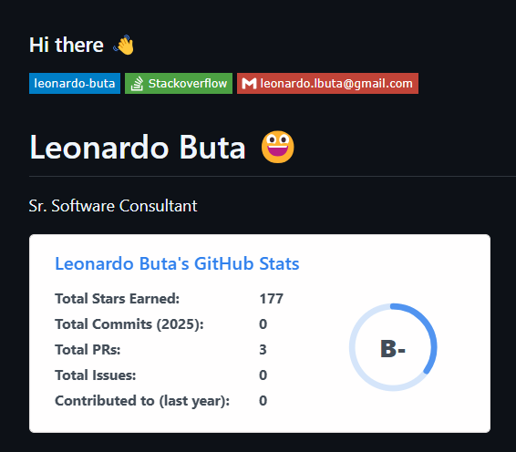

# C# - DESENVOLVIMENTO .NET - DIO [(Digital Inovation One)](https://dio.me/)

Professor Orientador: Leonardo Buta.

| Perfil GIT | Dados Profissionais. |
|---------------------------------------------|----------------------------------------| 
| |  |

## CERTIFICADO DE CONCLUSÃO DO CURSO...

